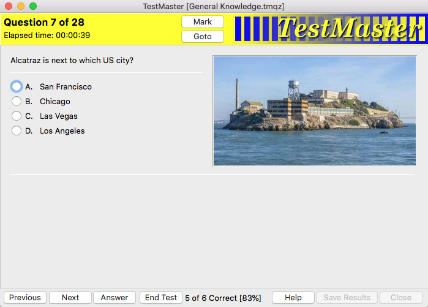

## Introduction

In 1998 whilst undertaking my training for Microsoft Certified Systems Engineer (MCSE), I developed a program to create, edit and execute multiple-choice questions… *TestMaster*. It was written in Pascal using Borland Delphi.

Many people have used it over the years and I had reason recently to resurrect it, although now I am Mac based and use Lazarus/FPC in lieu of Delphi, so it got ported and some rework too.

*TestMaster* provides the following features:

- Central control of all question sets with summary information for each
- Optional exhibit (graphic) for each question
- Answer choices can be single or multiple answers
- Option to randomise question order
- Option to randomise answer choices order (question by question)
- Ability to set questions as 'marked' and go back to them
- Option to 'preview' answers, with explanatory notes (if provided)
- On screen time indication; either elapsed time or time remaining
- Maintained results summary of tests taken, results and which questions were answered incorrectly (this permits individuals to monitor their progress over time)

Some of the features of the original program have been removed as they are no longer relevant to open-source software:

- restrictions if not-registered
- encrypted data files

## Notes

When compiling, Lazarus/FPC will put all build files in a "*_build*" folder, and the executable in a "*_bin*" folder. I put the underscore in front of these (and some other folders) to remind me which folders do not need to be pushed to GitHub.

### Windows

Not yet tested on Windows, but will need to copy the resources files into the same location as the EXE file, setup icon, etc

### Mac

Having cloned / downloaded the files there are some additional preparations required:

- create App bundle: create a ".app" bundle for *TestMaster* via Lazarus' "*Project | Project Options*" and the "*Create Application Bundle*" button. This will put a ".app" file in the *_bin* folder with the *TestMaster* executable
- copy the files in the "*resources*" folder into the *TestMaster.app/Contents/Resources* folder. These are the help, logo and icons files required by *TestMaster*

Note: when ready to use the ".app" file elsewhere ensure you move the *TestMaster* executable file into the *TestMaster.app/Contents/MacOS* folder, replacing the alias put there by Lazarus. Put the ".app" file in a DMG file for distribution

## License

This software has been released under the [GNU General Public License](https://www.gnu.org/licenses/) as published by the Free Software Foundation
